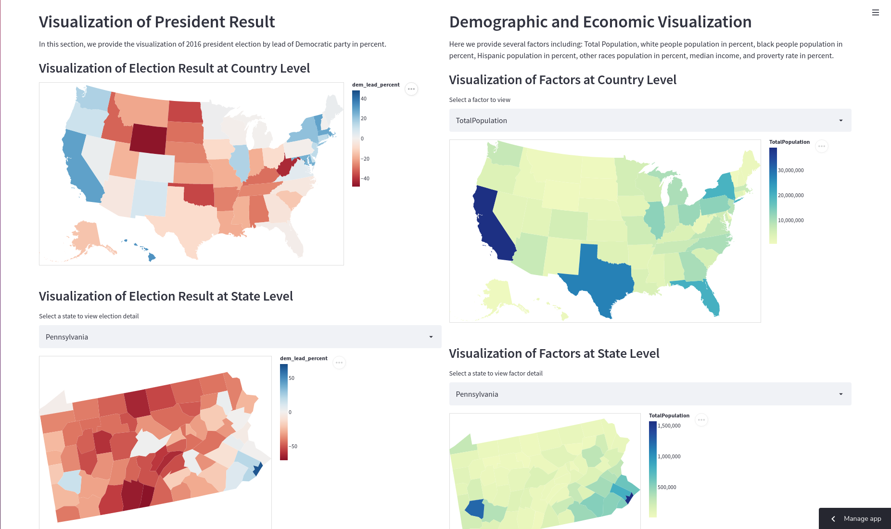

# Demographical and Economic Insights behind 2016 president election

Author: **Fan Shi (fans@andrew.cmu.edu**
Website: **https://share.streamlit.io/fan-shi/cmu-ids-assignment2/main**  

Last year, we had a very exciting president election which elected Joe Biden in the office. When we open the news app last year, it would display the detailed visualization of polling / election result on states and counties. This project was enlighted by the election visualization and applies similar visualization technique on other import social factors.  

## Project Goal  

The goal for this project is to help beginner of US politics to have better understand of election in United States. Also, it can serve as a tool to introduce basic encomic and demographical status of United States.  

We can summarize the project goal into several points:  

- Obtain some insights for 2016 Election from Census data.  
- Analyze the correlection between social status and election result.  
- Get familiar with United States' society from census result.  

## Project Design

### Select Dataset

Obtain the appropriate dataset is the key for this project. At starting stage, I planned to create similar visualization I saw during election and use the project as an opportunity to understand United States. After browsing several hours in Kaggle dataset, I have a list of candidates and I finally decided to visualize election data and census data. I believe there exists a strong connection between a place's social status and the election result. 

### Design Choice  

After obtaining the dataset, I have an idea to include two kinds of visualizations. One is Country level visualziation which display the summarized result for each state. Another is State level visualziation which display the result for each county inside the result.  

Initially, I put election and census result together and set election as one of choice in the selectbox. Later, I found it's better to split the visualziation of election and census to provide a better chance of Comparison study. The page of first version looks like a notebook where I display each graph from the top. However, under this design we need to scroll up and down to compare graphs. Then I turn into the final design to split the app into two columns.  

### Alternative Choice  

I also planned to provide a visualization to display the change of economic factors overtime. THe user can select two particular year (ex. 1990, 2016) to view the difference in income and employment status. However, I later gave up the plan due to lack of proper dataset in Kaggle.  

## Decelopment  

As for development, Fan Shi finish the whole project solely. Data collection takes around 2 hours. Learn streamlit and how to plot data on map takes 3 hours. Performing data parsing/transformation. creating python app, and making improvement takes around 8 hours. The total project takes a summarized of 13 working hours.  

Learn to create beaultiful visualizations takes the most amount effort as I lack the experience of data visualziation and the documentation of altair package is not very clear.  

